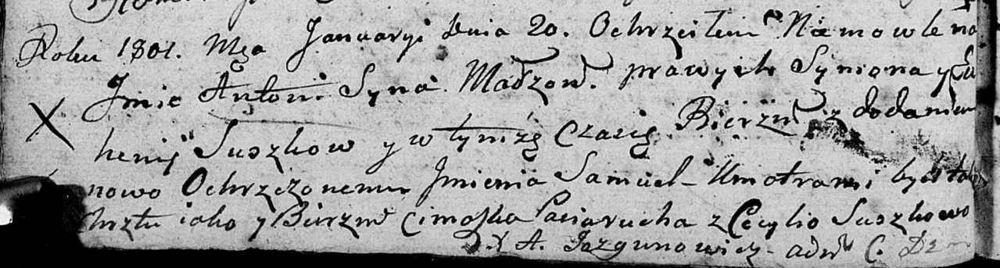

**Сушко Евгения (Suszkowa Euhenija)**

20 января 1801 г -- крещение сына Антона Самуэля (НИАБ 136-13-894, лист
42об, №3/1801-р (ориг)).

**НИАБ 136-13-894:** Лист 42об. **Метрическая запись №3/1801-р (ориг).**

Дедиловичская Покровская церковь. 20 января 1801 года. Метрическая
запись о крещении.

Suszko Antoni Samuel -- дочь родителей с деревни Осовo.

Suszko Symon -- отец.

Suszkowa Euhenija -- мать.

Paciarucha Cimoszka -- кум, с деревни Осовo.

Suszkowa Cecylija -- кума, с деревни Осовo.

Jazgunowicz Antoni -- ксёндз.
