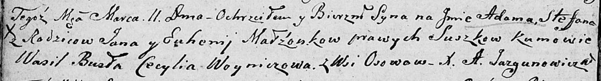

**Сушко Адам Янков (Suszko Adam Stefan)**

11 марта 1806 г -- крещение (НИАБ 136-13-894, лист 59об, №11/1806-р
(ориг)).

**НИАБ 136-13-894:** Лист 59об. **Метрическая запись №11/1806-р
(ориг).**

Дедиловичская Покровская церковь. 11 марта 1806 года. Метрическая запись
о крещении.

Suszko Adam Stefan -- сын родителей с деревни Осовo.

Suszko Jan -- отец.

Suszkowa Euhenija -- мать.

Busła Wasil -- кум.

Woyniczowa Cecylia -- кума.

Jazgunowicz Antoni -- ксёндз.
