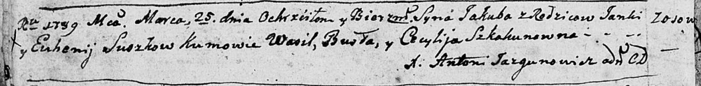

**Сушко Якуб Янков (Suszko Jakub)**

29 марта 1789 г -- крещение (НИАБ 136-13-894, лист 6об, №19/1789-р
(ориг)), (См. тж.: РГИА 823-2-18, лист 237об, №9/1789-р (коп)).

**НИАБ 136-13-894:** Лист 6об. **Метрическая запись №19/1789-р (ориг).**

Дедиловичская Покровская церковь. 25 марта 1789 года. Метрическая запись
о крещении.

Suszko Jakub -- сын родителей с деревни Осово.

Suszko Janka -- отец.

Suszkowa Euhenija -- мать.

Busła Wasil - кум.

Szkakunowna Cecylija - кума.

Jazgunowicz Antoni -- ксёндз.

**РГИА 823-2-18:** Лист 237об. **Метрическая запись №9/1789-р (коп).**

Дедиловичская Покровская церковь. 25 марта 1789 года. Метрическая запись
о крещении.

Suszko Jakub -- сын родителей с деревни Шилы \[Осово\].

Suszko Jan -- отец.

Suszko Euhenija -- мать.

Szyło Karp -- кум.

Szyłowa Pałanieja - кума.

Jazgunowicz Antoni -- ксёндз.
