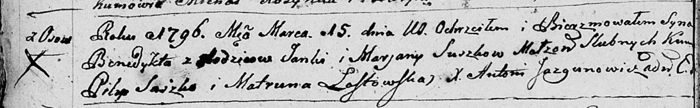
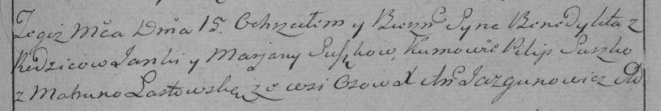

**Сушко Бенедыкт Янков (Suszko Benedykt)**

15 марта 1796 г -- крещение сына Бенедыкта (НИАБ 136-13-894, лист 28об,
№31/1796-р (ориг)), (РГИА 823-2-18, лист 255, №12/1796-р (коп)).

**НИАБ 136-13-894:** Лист 28-об. **Метрическая запись №31/1796-р
(ориг).**

Дедиловичская Покровская церковь. 15 марта 1796 года. Метрическая запись
о крещении.

Suszko Benedykt -- сын родителей с деревни Осовo.

Suszko Janka -- отец.

Suszkowa Marjana -- мать.

Suszko Pilip - кум.

Łastowska Matruna - кума.

Jazgunowicz Antoni -- ксёндз.

**РГИА 823-2-18:** Лист 255. **Метрическая запись №12/1796-р (коп).**

Дедиловичская Покровская церковь. 15 марта 1796 года. Метрическая запись
о крещении.

Suszko Benedykt -- сын родителей с деревни Осово.

Suszko Janka -- отец.

Suszkowa Marjana -- мать.

Suszko Pilip -- кум.

Łastowska Matruna -- кума.

Jazgunowicz Antoni -- ксёндз.
