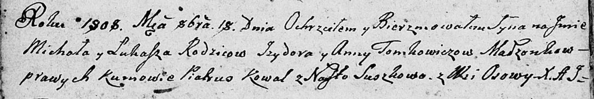

**Томкович Изыдор (Tomkowicz, Tomkiewicz Jzydor)**

26 октября 1802 г -- венчание с Анной Авдюхович с деревни Замосточье
(НИАБ 136-13-894, лист 8, №3/1802-б (ориг)).

17 июля 1804 г -- крещение сына Адама Ильи (НИАБ 136-13-894, лист 54,
№21/1804-р (ориг)).

18 октября 1808 г -- крещение сына Михала Луки (НИАБ 136-13-894, лист
72об, №36/1808-р (ориг)).

**НИАБ 136-13-920:** Лист 8. **Метрическая запись №3/1802-б (ориг).**

Дедиловичская Покровская церковь. 26 октября 1802 года. Метрическая
запись о венчании.

Tomkiewicz Jzydor -- жених, молодой, с деревни Осовo.

Awdziuchowichowna Anna -- невеста, с деревни Замосточье.

Rоhula Łukasz -- свидетель, с деревни Соболевка.

Suszko Bautruk -- свидетель, с деревни Разлитье.

Jazgunowicz Antoni -- ксёндз.

**НИАБ 136-13-894:** Лист 54. **Метрическая запись №21/1804-р (ориг).**

Дедиловичская Покровская церковь. 17 июля 1804 года. Метрическая запись
о крещении.

Tomkowicz Adam Eliasz -- сын родителей с деревни Осовo.

Tomkowicz Jzydor -- отец.

Tomkowiczowa Anna -- мать.

Kawal Hryhor -- кум.

Czaplayowa Nastazya -- кума.

Jazgunowicz Antoni -- ксёндз.

**НИАБ 136-13-894:** Лист 72об. **Метрическая запись №36/1808-р
(ориг).**

Дедиловичская Покровская церковь. 18 октября 1808 года. Метрическая
запись о крещении.

Tomkowicz Michał Łukasz -- сын родителей с деревни Осово.

Tomkowicz Jzydor -- отец.

Tomkowiczowa Anna -- мать.

Kowal Piatruś -- кум.

Suszkowa Nasta -- кума.

Jazgunowicz Antoni -- ксёндз.
