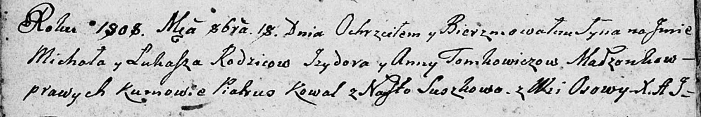

**Томкович Михал Изыдоров (Tomkowicz Michał Łukasz)**

18 октября 1808 г -- крещение (НИАБ 136-13-894, лист 72об, №36/1808-р
(ориг)).

**НИАБ 136-13-894:** Лист 72об. **Метрическая запись №36/1808-р
(ориг).**

{width="6.496527777777778in"
height="1.092253937007874in"}

Дедиловичская Покровская церковь. 18 октября 1808 года. Метрическая
запись о крещении.

Tomkowicz Michał Łukasz -- сын родителей с деревни Осово.

Tomkowicz Jzydor -- отец.

Tomkowiczowa Anna -- мать.

Kowal Piatruś -- кум.

Suszkowa Nasta -- кума.

Jazgunowicz Antoni -- ксёндз.
