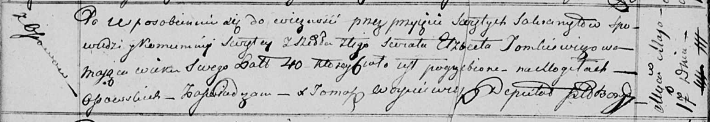

**Томкович Агата Изыдорова (Tomkowiczowna Agata)**

26 марта 1817 г -- крещение (НИАБ 136-13-894, лист 96, №22/1817-р
(ориг)).

**НИАБ 136-13-894:** Лист 96. **Метрическая запись №22/1817-р (ориг).**

{width="6.496527777777778in"
height="1.0473293963254593in"}

Осовская Покровская церковь. 26 марта 1817 года. Метрическая запись о
крещении.

Tomkowiczowna Agata -- дочь родителей с деревни Осовo.

Tomkowicz Jzydor -- отец.

Tomkowiczowa Elżbieta -- мать.

Kowal Piotr -- кум.

Suszkowa Nasta -- кума.

Woyniewicz Tomasz -- ксёндз.
