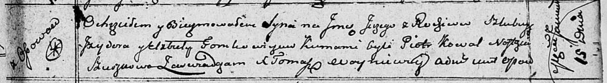
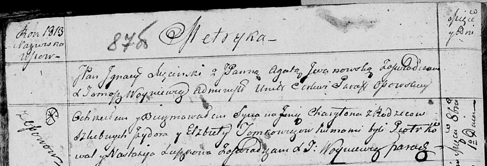
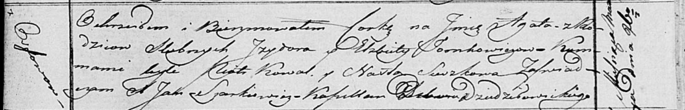

**Томкович Изыдор (Tomkowicz Jzydor)**

15 января 1811 г -- крещение сына Сергея (НИАБ 136-13-894, лист 80,
№6/1811-р (ориг)).

1 октября 1813 г -- крещение сына Харытона (НИАБ 136-13-894, лист 87об,
№30/1813-р (ориг)).

26 марта 1817 г -- крещение дочери Агаты (НИАБ 136-13-894, лист 96,
№22/1817-р (ориг)).

**НИАБ 136-13-894:** Лист 80. **Метрическая запись №6/1811-р (ориг).**

Осовская Покровская церковь. 15 января 1811 года. Метрическая запись о
крещении.

Tomkowicz Jerzy -- сын родителей с деревни Осовo.

Tomkowicz Jzydor -- отец.

Tomkowiczowa Elżbieta -- мать.

Kowal Piotr -- кум.

Szuszkowa Nastazya -- кума.

Woyniewicz Tomasz -- ксёндз.

**НИАБ 136-13-894:** Лист 87об. **Метрическая запись №30/1813-р
(ориг).**

Осовская Покровская церковь. 1 октября 1813 года. Метрическая запись о
крещении.

Tomkowicz Charyton -- сын родителей с деревни Осовo.

Tomkowicz Jzydor -- отец.

Tomkowiczowa Elżbieta -- мать.

Kowal Piotr -- кум.

Suszkowa Nastazija -- кума.

Woyniewicz Tomasz -- ксёндз.

**НИАБ 136-13-894:** Лист 96. **Метрическая запись №22/1817-р (ориг).**

Осовская Покровская церковь. 26 марта 1817 года. Метрическая запись о
крещении.

Tomkowiczowna Agata -- дочь родителей с деревни Осовo.

Tomkowicz Jzydor -- отец.

Tomkowiczowa Elżbieta -- мать.

Kowal Piotr -- кум.

Suszkowa Nasta -- кума.

Woyniewicz Tomasz -- ксёндз.
