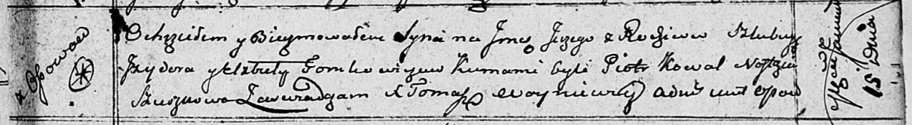

**Томкович Сергей Изыдоров (Tomkowicz Jerzy)**

15 января 1811 г -- крещение (НИАБ 136-13-894, лист 80, №6/1811-р
(ориг)).

**НИАБ 136-13-894:** Лист 80. **Метрическая запись №6/1811-р (ориг).**

Осовская Покровская церковь. 15 января 1811 года. Метрическая запись о
крещении.

Tomkowicz Jerzy -- сын родителей с деревни Осовo.

Tomkowicz Jzydor -- отец.

Tomkowiczowa Elżbieta -- мать.

Kowal Piotr -- кум.

Szuszkowa Nastazya -- кума.

Woyniewicz Tomasz -- ксёндз.
