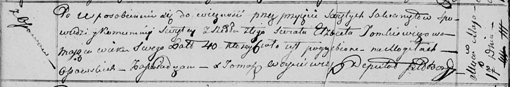

**Томкович Харытон Изыдоров (Tomkowicz Charyton)**

1 октября 1813 г -- крещение (НИАБ 136-13-894, лист 87об, №30/1813-р
(ориг)).

**НИАБ 136-13-894:** Лист 87об. **Метрическая запись №30/1813-р
(ориг).**

{width="6.496527777777778in"
height="2.223396762904637in"}

Осовская Покровская церковь. 1 октября 1813 года. Метрическая запись о
крещении.

Tomkowicz Charyton -- сын родителей с деревни Осовo.

Tomkowicz Jzydor -- отец.

Tomkowiczowa Elżbieta -- мать.

Kowal Piotr -- кум.

Suszkowa Nastazija -- кума.

Woyniewicz Tomasz -- ксёндз.
