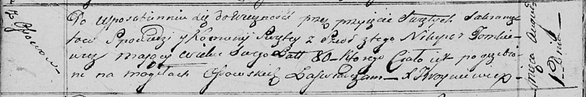

**Томкович Никипер (Tomkowicz Nikiper)**

6 января 1796 г -- крещение сына Яна (НИАБ 136-13-894, лист 31об,
№2/1797-р (ориг)), (РГИА 823-2-18, лист 258об, №2/1797-р (коп)).

1 августа 1817 г -- отпевание, умер в возрасте 80 лет (родился около
1737 г) (НИАБ 136-13-919, лист 30об, №13/1817-у (ориг)).

**НИАБ 136-13-894:** Лист 31-об. **Метрическая запись №2/1797-р
(ориг).**

{width="6.496527777777778in"
height="1.2015463692038495in"}

Дедиловичская Покровская церковь. 6 января 1797 года. Метрическая запись
о крещении.

Tomkowicz Jan -- сын родителей с деревни Осовo.

Tomkowicz Nikiper -- отец.

Tomkowiczowa Taciana -- мать.

Skakun Kondrat - кум.

Skakunowa Darya - кума.

Jazgunowicz Antoni -- ксёндз.

**РГИА 823-2-18:** Лист 258об. **Метрическая запись №2/1797-р (коп).**

{width="6.496527777777778in"
height="1.5979166666666667in"}

Дедиловичская Покровская церковь. 6 января 1797 года. Метрическая запись
о крещении.

Tomkowicz Jan -- сын родителей с деревни Осово.

Tomkowicz Nikiper -- отец.

Tomkowiczowa Tacianna -- мать.

Skakun Kondrat -- кум.

Skakunowa Darya -- кума.

Jazgunowicz Antoni -- ксёндз.

**НИАБ 136-13-919:** Лист 30об. **Метрическая запись №13/1817-у
(ориг).**

{width="6.496527777777778in"
height="1.0909722222222222in"}

Осовская униатская церковь. 1 августа 1817 года. Метрическая запись об
отпевании.

Tomkiewicz Nikiper -- умерший, 80 лет, с деревни Осово, похоронен на
кладбище деревни Осово.

Woyniewicz Tomasz -- ксёндз.
