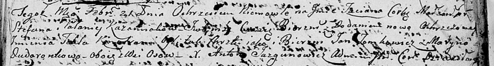

**Томкович Ян Никиперов (Tomkowicz Jan)**

6 января 1796 г -- крещение (НИАБ 136-13-894, лист 31об, №2/1797-р
(ориг)), (РГИА 823-2-18, лист 258об, №2/1797-р (коп)).

21 февраля 1804 г -- крестный отец у Татьяны Текли, дочери Кожемяк
Степана и Паланеи (НИАБ 136-13-894, лист 53, №6/1804-р (ориг)).

**НИАБ 136-13-894:** Лист 31-об. **Метрическая запись №2/1797-р
(ориг).**

{width="6.496527777777778in"
height="1.2015463692038495in"}

Дедиловичская Покровская церковь. 6 января 1797 года. Метрическая запись
о крещении.

Tomkowicz Jan -- сын родителей с деревни Осовo.

Tomkowicz Nikiper -- отец.

Tomkowiczowa Taciana -- мать.

Skakun Kondrat - кум.

Skakunowa Darya - кума.

Jazgunowicz Antoni -- ксёндз.

**РГИА 823-2-18:** Лист 258об. **Метрическая запись №2/1797-р (коп).**

{width="6.496527777777778in"
height="1.5979166666666667in"}

Дедиловичская Покровская церковь. 6 января 1797 года. Метрическая запись
о крещении.

Tomkowicz Jan -- сын родителей с деревни Осово.

Tomkowicz Nikiper -- отец.

Tomkowiczowa Tacianna -- мать.

Skakun Kondrat -- кум.

Skakunowa Darya -- кума.

Jazgunowicz Antoni -- ксёндз.

**НИАБ 136-13-894:** Лист 53. **Метрическая запись №6/1804-р (ориг).**

{width="6.496527777777778in"
height="0.8770209973753281in"}

Дедиловичская Покровская церковь. 21 февраля 1804 года. Метрическая
запись о крещении.

Każamiakowna Taciana Tekla -- дочь.

Każamiaka Stefan -- отец.

Każamiakowa Pałanieja -- мать.

Tomkowicz Jan -- кум, с деревни Осовo.

Dudaronkowa Maryna -- кума, с деревни Осовo.

Jazgunowicz Antoni -- ксёндз.
