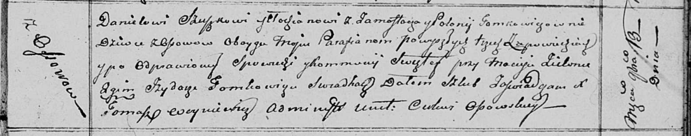

**Сушко (в девичестве Томкович) Полония (Szuszkowa, Suszkowa Połonija z
Tomkowiczow)**

13 ноября 1810 г -- венчание с молодым Данилой Сушко с деревни
Замосточье (НИАБ 136-13-920, лист 17, №11/1810-б (ориг)).

**НИАБ 136-13-920:** Лист 17. **Метрическая запись №11/1810-б (ориг).**

{width="6.496527777777778in"
height="1.2799945319335082in"}

Осовская Покровская церковь. 13 ноября 1810 года. Метрическая запись о
венчании.

Szuszko Daniel -- жених, молодой, парафии Осовской, с деревни
Замосточье.

Tomkowiczowna Połonija -- невеста, девка, парафии Осовской, с деревни
Осово.

Zielonka Maciey -- свидетель.

Tomkowicz Jzydor -- свидетель.

Woyniewicz Tomasz -- ксёндз.
