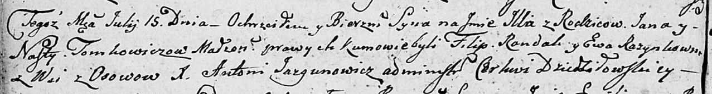

**Томкович Андрей Янов (Tomkowicz Andrzey)**

21 марта 1809 г -- крещение (НИАБ 136-13-894, лист 73об, №10/1809-р
(ориг)).

**НИАБ 136-13-894:** Лист 73об. **Метрическая запись №10/1809-р
(ориг).**

{width="6.496527777777778in"
height="1.2578685476815399in"}

Дедиловичская Покровская церковь. 21 марта 1809 года. Метрическая запись
о крещении.

Tomkowicz Andrzey -- сын родителей с деревни Осовo.

Tomkowicz Jan -- отец.

Tomkowiczowa Nasta -- мать.

Randak Filip -- кум.

Razynkowa Nasta -- кума.

Jazgunowicz Antoni -- ксёндз.
