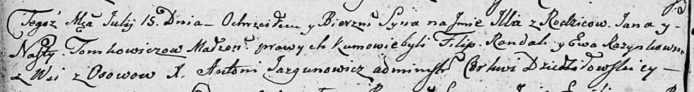

**Томкович Марьяна Янова (Tomkowiczowna Marjana)**

25 декабря 1811 г -- крещение (НИАБ 136-13-894, лист 82об, №65/1811-р
(ориг)).

**НИАБ 136-13-894:** Лист 82об. **Метрическая запись №65/1811-р
(ориг).**

{width="6.496527777777778in"
height="0.891101268591426in"}

Осовская Покровская церковь. 25 декабря 1811 года. Метрическая запись о
крещении.

Tomkowiczowna Marjana -- дочь родителей с деревни Осовo.

Tomkowicz Jan -- отец.

Tomkowiczowa Nastazija -- мать.

Randak Filip -- кум.

Rozynkowa Nasta -- кума.

Woyniewicz Tomasz -- ксёндз.
