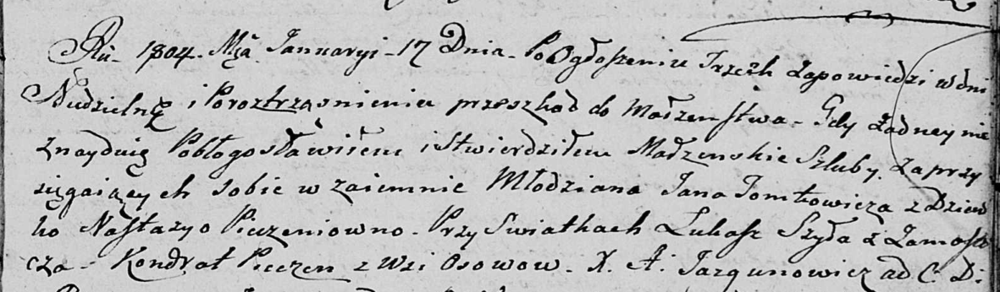
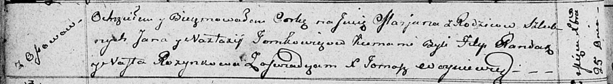
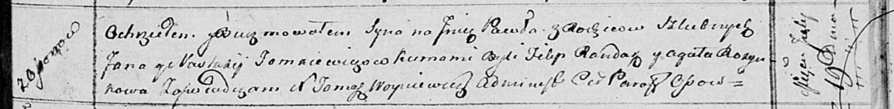
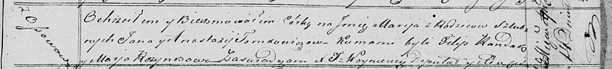

**Томкович (Печень) Наста (Tomkowiczowa, Tomacewiczowa Nasta, Nastazija,
Anastazija z Pieczaniow)**

17 января 1804 г -- венчание с молодым Яном Томковичем с деревни Осово
(НИАБ 136-13-920, лист 10, №1/1804-б (ориг)).

15 июля 1806 г -- крещение сына Ильи (НИАБ 136-13-894, лист 60об,
№31/1806-р (ориг)).

21 марта 1809 г -- крещение сына Андрея (НИАБ 136-13-894, лист 73об,
№10/1809-р (ориг)).

25 декабря 1811 г -- крещение дочери Марьяны (НИАБ 136-13-894, лист
82об, №65/1811-р (ориг)).

19 июля 1814 г -- крещение сына Павла (НИАБ 136-13-894, лист 90,
№44/1814-р (ориг)).

14 апреля 1821 г -- крещение дочери Марии (НИАБ 136-13-894, лист 106,
№20/1821-р (ориг)).

**НИАБ 136-13-920:** Лист 10. **Метрическая запись №1/1804-б (ориг).**

Дедиловичская Покровская церковь. 17 января 1804 года. Метрическая
запись о венчании.

Tomkowicz Jan -- жених, молодой с деревни \[Осово\].

Pieczaniowna Nastazya -- невеста, девка.

Szyła Łukasz -- свидетель, с деревни Замосточье.

Pieczan Kondrat -- свидетель, с деревни Осовo.

Jazgunowicz Antoni -- ксёндз.

**НИАБ 136-13-894:** Лист 60об. **Метрическая запись №31/1806-р
(ориг).**

Дедиловичская Покровская церковь. 15 июля 1806 года. Метрическая запись
о крещении.

Tomkowicz Jlla -- сын родителей с деревни Осовo.

Tomkowicz Jan -- отец.

Tomkowiczowa Nasta -- мать.

Randak Filip -- кум.

Rozynkowna Ewa -- кума.

Jazgunowicz Antoni -- ксёндз.

**НИАБ 136-13-894:** Лист 73об. **Метрическая запись №10/1809-р
(ориг).**

Дедиловичская Покровская церковь. 21 марта 1809 года. Метрическая запись
о крещении.

Tomkowicz Andrzey -- сын родителей с деревни Осовo.

Tomkowicz Jan -- отец.

Tomkowiczowa Nasta -- мать.

Randak Filip -- кум.

Razynkowa Nasta -- кума.

Jazgunowicz Antoni -- ксёндз.

**НИАБ 136-13-894:** Лист 82об. **Метрическая запись №65/1811-р
(ориг).**

Осовская Покровская церковь. 25 декабря 1811 года. Метрическая запись о
крещении.

Tomkowiczowna Marjana -- дочь родителей с деревни Осовo.

Tomkowicz Jan -- отец.

Tomkowiczowa Nastazija -- мать.

Randak Filip -- кум.

Rozynkowa Nasta -- кума.

Woyniewicz Tomasz -- ксёндз.

**НИАБ 136-13-894:** Лист 90. **Метрическая запись №44/1814-р (ориг).**

Осовская Покровская церковь. 19 июля 1814 года. Метрическая запись о
крещении.

Tomacewicz Paweł -- сын родителей с деревни Осовo.

Tomacewicz Jan -- отец.

Tomacewiczowa Nastacija -- мать.

Randak Filip -- кум.

Rozynkowa Agata -- кума.

Woyniewicz Tomasz -- ксёндз.

**НИАБ 136-13-894:** Лист 106. **Метрическая запись №20/1821-р (ориг).**

Осовская Покровская церковь. 14 апреля 1821 года. Метрическая запись о
крещении.

Tomkowiczowna Marija -- дочь родителей с деревни Осовo.

Tomkowicz Jan -- отец.

Tomkowiczowa Anastazija -- мать.

Randak Filip -- кум.

Rozynkowa Marja -- кума.

Woyniewicz Tomasz -- ксёндз.
