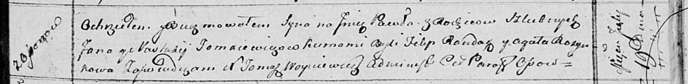

**Томкович Павел Янов (Tomacewicz Paweł)**

19 июля 1814 г -- крещение (НИАБ 136-13-894, лист 90, №44/1814-р
(ориг)).

**НИАБ 136-13-894:** Лист 90. **Метрическая запись №44/1814-р (ориг).**

Осовская Покровская церковь. 19 июля 1814 года. Метрическая запись о
крещении.

Tomacewicz Paweł -- сын родителей с деревни Осовo.

Tomacewicz Jan -- отец.

Tomacewiczowa Nastacija -- мать.

Randak Filip -- кум.

Rozynkowa Agata -- кума.

Woyniewicz Tomasz -- ксёндз.
