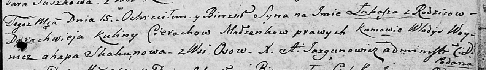

**Церах Дарахвей (Cierach Darachwiey)**

15 октября 1805 г -- крещение сына Лукаша (НИАБ 136-13-894, лист 58,
№45/1805-р (ориг)).

**НИАБ 136-13-894:** Лист 58. **Метрическая запись №45/1805-р (ориг).**

Дедиловичская Покровская церковь. 15 октября 1805 года. Метрическая
запись о крещении.

Cierach Łukasz -- сын родителей с деревни Осовo.

Cierach Darachwiey -- отец.

Cierachowa Kulina -- мать.

Woynicz Władyś -- кум.

Skakunowa Ahapa -- кума.

Jazgunowicz Antoni -- ксёндз.
