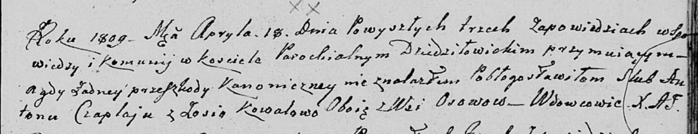

**Чапляй Антон (Czaplay Anton)**

18 апреля 1809 г -- венчание с вдовой Зосей Ковалёвой с деревни Осово
(НИАБ 136-13-920, лист 15, №6/1809-б (ориг)).

**НИАБ 136-13-920:** Лист 15. **Метрическая запись №6/1809-б (ориг).**

Дедиловичская Покровская церковь. 18 апреля 1809 года. Метрическая
запись о венчании.

Czaplay Anton -- жених, вдовец, с деревни Осовo.

Kowalowa Zosia -- невеста, вдова, с деревни Осовo.

Jazgunowicz Antoni -- ксёндз.
