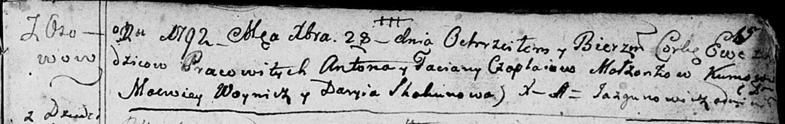

**Чапляй Ева Антонова (Czaplaiowna Ewa)**

28 декабря 1791 г -- крещение (НИАБ 136-13-894, лист 15, №71/1791-р
(ориг)).

**НИАБ 136-13-894:** Лист 15. **Метрическая запись №71/1791-р (ориг).**

Дедиловичская Покровская церковь. 28 декабря 1791 года. Метрическая
запись о крещении.

Czaplaiowna Ewa -- дочь селян с деревни Осовo.

Czaplay Anton -- отец.

Czaplaiowa Taciana -- мать.

Woynicz Macwiey - кум.

Skakunowa Daryia - кума.

Jazgunowicz Antoni -- ксёндз.
