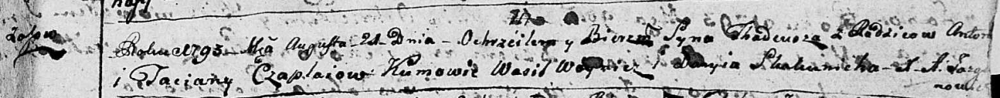

**Чапляй Тадей Антонов (Czaplay Thadeusz)**

21 августа 1793 г -- крещение (НИАБ 136-13-894, лист 20, №62/1793-р
(ориг)), (РГИА 823-2-18, лист 248, №34/1793-р (коп)).

**НИАБ 136-13-894:** Лист 20. **Метрическая запись №62/1793-р (ориг).**

Дедиловичская Покровская церковь. 21 августа 1793 года. Метрическая
запись о крещении.

Czaplay Thadeusz -- сын родителей с деревни Осовo.

Czaplay Anton -- отец.

Czaplaiowa Taciana -- мать.

Woynicz Wasil - кум.

Skakunicha Daryia - кума.

Jazgunowicz Antoni -- ксёндз.

**РГИА 823-2-18:** Лист 248. **Метрическая запись №34/1793-р (коп).**

Дедиловичская Покровская церковь. 21 августа 1793 года. Метрическая
запись о крещении.

Czaplay Tadeusz -- сын родителей с деревни Осово.

Czaplay Antoni -- отец.

Czaplajowa Tacianna -- мать.

Woynicz Wasil -- кум.

Skakunowa Darya -- кума.

Jazgunowicz Antoni -- ксёндз.
