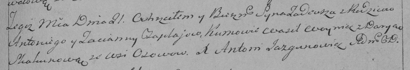

**Чапляй Татьяна (Czaplaiowa Taciana)**

28 декабря 1791 г -- крещение дочери Евы (НИАБ 136-13-894, лист 15,
№71/1791-р (ориг)).

21 августа 1793 г -- крещение сына Тадея (НИАБ 136-13-894, лист 20,
№62/1793-р (ориг)), (РГИА 823-2-18, лист 248, №34/1793-р (коп)).

25 ноября 1800 г -- крестная мать Зофии Анны, дочери Зелёнков Грышки и
Катерыны с деревни Замосточье (НИАБ 136-13-894, лист 42об, №33/1800-р
(ориг), НИАБ 136-13-949, лист 104, №36/1800-р (коп)).

12 марта 1805 г -- крестная мать Елены Евдокии, дочери Кожемяк Евсефия и
Анны (НИАБ 136-13-894, лист 57, №18/1805-р (ориг)).

**НИАБ 136-13-894:** Лист 15. **Метрическая запись №71/1791-р (ориг).**

{width="6.496527777777778in"
height="1.0379429133858267in"}

Дедиловичская Покровская церковь. 28 декабря 1791 года. Метрическая
запись о крещении.

Czaplaiowna Ewa -- дочь селян с деревни Осовo.

Czaplay Anton -- отец.

Czaplaiowa Taciana -- мать.

Woynicz Macwiey - кум.

Skakunowa Daryia - кума.

Jazgunowicz Antoni -- ксёндз.

**НИАБ 136-13-894:** Лист 20. **Метрическая запись №62/1793-р (ориг).**

{width="6.496527777777778in"
height="0.6369805336832896in"}

Дедиловичская Покровская церковь. 21 августа 1793 года. Метрическая
запись о крещении.

Czaplay Thadeusz -- сын родителей с деревни Осовo.

Czaplay Anton -- отец.

Czaplaiowa Taciana -- мать.

Woynicz Wasil - кум.

Skakunicha Daryia - кума.

Jazgunowicz Antoni -- ксёндз.

**РГИА 823-2-18:** Лист 248. **Метрическая запись №34/1793-р (коп).**

{width="6.496527777777778in"
height="1.11875in"}

Дедиловичская Покровская церковь. 21 августа 1793 года. Метрическая
запись о крещении.

Czaplay Tadeusz -- сын родителей с деревни Осово.

Czaplay Antoni -- отец.

Czaplajowa Tacianna -- мать.

Woynicz Wasil -- кум.

Skakunowa Darya -- кума.

Jazgunowicz Antoni -- ксёндз.

**НИАБ 136-13-894:** Лист 42об. **Метрическая запись №33/1800-р
(ориг).**

{width="6.496527777777778in"
height="1.5656299212598426in"}

Дедиловичская Покровская церковь. 25 ноября 1800 года. Метрическая
запись о крещении.

Zielonkowna Zofia Anna -- дочь родителей с деревни Замосточье.

Zielonka Hryszka -- отец.

Zielonkowa Katerzyna -- отец.

Suszko Paweł -- кум, с деревни Осовo.

Czaplajowa Taciana -- кума, с деревни Осовo.

Jazgunowicz Antoni -- ксёндз.

**НИАБ 136-13-894:** Лист 42об. **Метрическая запись №33/1800-р
(ориг).**

{width="6.496527777777778in"
height="1.5656299212598426in"}

Дедиловичская Покровская церковь. 25 ноября 1800 года. Метрическая
запись о крещении.

Zielonkowna Zofia Anna -- дочь родителей с деревни Замосточье.

Zielonka Hryszka -- отец.

Zielonkowa Katerzyna -- отец.

Suszko Paweł -- кум, с деревни Осовo.

Czaplajowa Taciana -- кума, с деревни Осовo.

Jazgunowicz Antoni -- ксёндз.

**НИАБ 136-13-894:** Лист 57. **Метрическая запись №18/1805-р (ориг).**

{width="6.496527777777778in"
height="1.1298020559930009in"}

Дедиловичская Покровская церковь. 12 марта 1805 года. Метрическая запись
о крещении.

Każamiakowna Helena Ewdokija -- дочь.

Każamiaka Ewsefi -- отец.

Każamiakowa Anna -- мать.

Hryhor -- кум, с деревни Осовo.

Czaplaiowa Taciana -- кума, с деревни Осовo.
