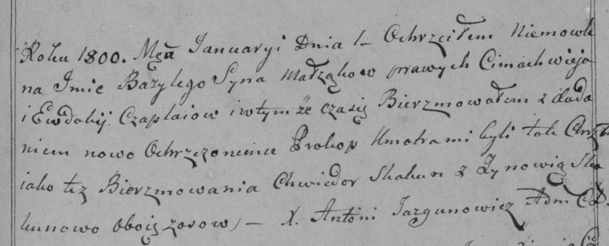

**Чапляй Цимахвей (Czaplay Cimachwiey)**

1 января 1800 г -- крещение сына Базылия Прохора (НИАБ 136-13-894, лист
40, №1/1800-р (ориг), (РГИА 823-2-18, лист 271, №1/1800-р (коп), НИАБ
136-13-949, лист 101, №1/1800-р (коп)).

**НИАБ 136-13-894:** Лист 40. **Метрическая запись №1/1800-р (ориг).**

Дедиловичская Покровская церковь. 1 января 1800 года. Метрическая запись
о крещении.

Czaplay Bazyli \[Prochor\] -- сын родителей с деревни Осовo.

Czaplay Cimachwiey -- отец.

Czaplaiowa Ewdokija -- мать.

Skakun Chwiedor -- кум, с деревни Замосточье.

Skakunowa Zynowija -- кума, с деревни Осовo.

Jazgunowicz Antoni -- ксёндз.

**РГИА 823-2-18:** Лист 274. **Метрическая запись №1/1800-р (коп).**

Дедиловичская Покровская церковь. 1 января 1800 года. Метрическая запись
о крещении.

Czaplay Bazyli Prochor -- сын родителей с деревни \[Осово\].

Czaplay Cimachwiey -- отец.

Czaplaiowa Ewdokija -- мать.

Skakun Chwiedor -- кум, с деревни Осово.

Skakunowa Zynowia -- кума, с деревни Осово.

Jazgunowicz Antoni -- ксёндз.

**НИАБ 136-13-949:** Лист 101. **Метрическая запись №1/1800-р (коп).**

(См. тж.: РГИА 823-2-18, лист 274, №1/1800-р (коп), НИАБ 136-13-894,
лист 40, №1/1800-р (ориг))

Дедиловичская Покровская церковь. 1 января 1800 года. Метрическая запись
о крещении.

Czaplay Bazyli Jan -- сын родителей с деревни \[Осово\].

Czaplay Cimachwiey -- отец.

Czaplaiowa Ewdokija -- мать.

Skakun Chwiedor -- кум, с деревни Замосточье.

Skakunowa Zynowia - кума, с деревни Осово.

Jazgunowicz Antoni -- ксёндз.
