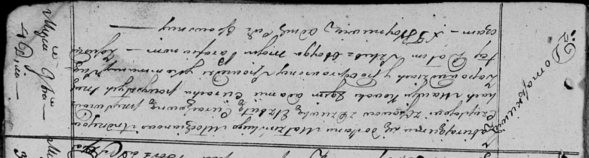

**Чапляй Андрей (Czaplay Andrzey)**

4 ноября 1818 г -- венчание с девкой Елисаветой Церах с деревни
Домашковичи, молодые в Домашковичах (НИАБ 136-13-920, лист 25, №6/1818-б
(ориг)).

**НИАБ 136-13-920:** Лист 25. **Метрическая запись №6/1818-б (ориг).**

{width="6.496527777777778in"
height="1.7473370516185476in"}

Осовская Покровская церковь. 4 ноября 1818 года. Запись о венчании.

Czapłay Andrzey -- жених, молодой, парафии Осовской, с деревни Осово.

Cierachowna Elżbieta -- невеста, девка, парафии Осовской, с деревни
Домашковичи.

Kowal Maciey -- свидетель.

Cierach Adam -- свидетель.

Woyniewicz Tomasz -- ксёндз.
