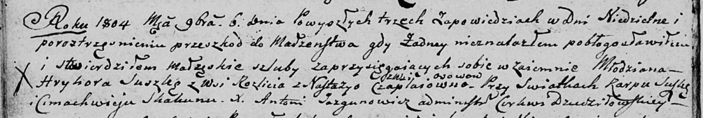

**Сушко (Чапляй) Настасья (Suszkowa (Czaplajowna) Nastazya)**

6 ноября 1804 г -- венчание с молодым Грыгором Сушко с деревни Разлитье
(НИАБ 136-13-920, лист 10об, №7/1804-б (ориг)).

**НИАБ 136-13-894:** Лист 10об. **Метрическая запись №7/1804-б (ориг).**

{width="6.496527777777778in"
height="1.0996292650918635in"}

Дедиловичская Покровская церковь. 6 ноября 1804 года. Метрическая запись
о венчании.

Suszko Hryhor -- жених, молодой, с деревни Разлитье.

Czapłajowna Nastazya -- невеста, с деревни Осовo.

Suszko Karp -- свидетель.

Skakun Cimachwiey -- свидетель.

Jazgunowicz Antoni -- ксёндз.
