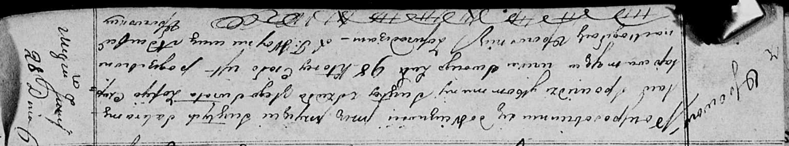

**Чапляй София (Czaplajowa Zofija)**

28 июня 1820 г -- отпевание, умерла в возрасте 98 лет (родилась около
1722 г) (НИАБ 136-13-919, лист 33об, №14/1820-у (ориг)).

**НИАБ 136-13-919:** Лист 33об. **Метрическая запись №14/1820-у
(ориг).**

{width="6.496527777777778in"
height="1.2069444444444444in"}

Осовская униатская церковь. 28 июня 1820 года. Метрическая запись об
отпевании.

Czaplajowa Zofija -- умершая, 98 лет, с деревни Осово, похоронена на
кладбище деревни Осово.

Woyniewicz Tomasz -- ксёндз.
