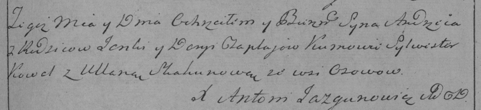

**Чапляй Андрей Янов (Czaplay Andrzey)**

17 августа 1796 г -- крещение (РГИА 823-2-18, лист 257, №43/1796-р
(коп)).

Лист 257. **Метрическая запись №43/1796-р (коп).**

Дедиловичская Покровская церковь. 17 августа 1796 года. Метрическая
запись о крещении.

Czaplay Andrzey -- сын родителей с деревни Осово.

Czaplay Janka -- отец.

Czaplajowa Daryia -- мать.

Kowal Sylwester -- кум.

Skakunowa Ullana -- кума.

Jazgunowicz Antoni -- ксёндз.
