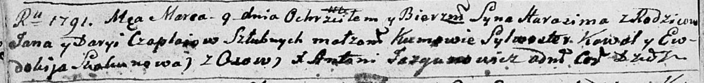

**Чапляй Гарасим (Czaplay Harasim)**

9 марта 1791 г -- крещение (НИАБ 136-13-894, лист 12об, №7/1791-р
(ориг)), (РГИА 823-2-18, лист 241об, №7/1791-р (коп)).

**НИАБ 136-13-894:** Лист 12об. **Метрическая запись №7/1791-р (ориг).**

Дедиловичская Покровская церковь. 9 марта 1791 года. Метрическая запись
о крещении.

Czaplay Harasim -- сын родителей с деревни Осово.

Czaplay Jan -- отец.

Czaplaiowa Daryja -- мать.

Kowal Sylwester - кум.

Skakunowa Ewdokija - кума.

Jazgunowicz Antoni -- ксёндз.

**РГИА 823-2-18:** Лист 241об. **Метрическая запись №7/1791-р (коп).**

Дедиловичская Покровская церковь. 9 марта 1791 года. Метрическая запись
о крещении.

Czaplay Harasim -- сын родителей с деревни Осово.

Czaplay Jan -- отец.

Czaplaiowa Darya -- мать.

Kawal Sylwester -- кум.

Skakunowa Eudokia - кума.

Jazgunowicz Antoni -- ксёндз.
