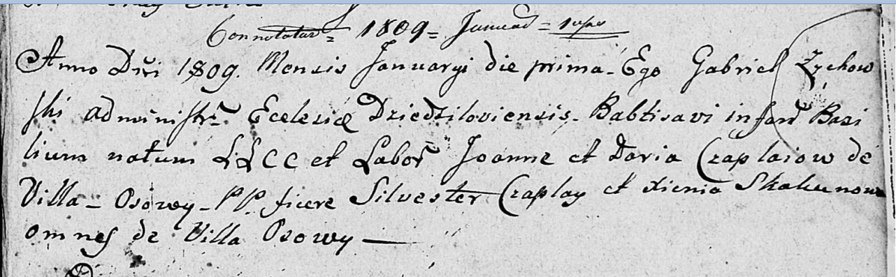

**Чапляй Дарыя (Czaplaiowa Daryja, Daryia)**

9 марта 1791 г -- крещение сына Гарасима (НИАБ 136-13-894, лист 12об,
№7/1791-р (ориг)), (РГИА 823-2-18, лист 241об, №7/1791-р (коп)).

29 января 1794 г -- крещение сына Игнат (НИАБ 136-13-894, лист 21,
№6/1794-р (ориг)), (РГИА 823-2-18, лист 249, №4/1794-р (коп)).

17 августа 1796 г -- крещение сына Андрея (РГИА 823-2-18, лист 257,
№43/1796-р (коп)).

15 октября 1805 г -- крещение дочери Параскевии (НИАБ 136-13-894, лист
58, №46/1805-р (ориг)).

1 января 1809 г -- крещение сына Базыля (НИАБ 136-13-894, лист 73,
№1/1809-р (ориг)).

**НИАБ 136-13-894:** Лист 12об. **Метрическая запись №7/1791-р (ориг).**

Дедиловичская Покровская церковь. 9 марта 1791 года. Метрическая запись
о крещении.

Czaplay Harasim -- сын родителей с деревни Осово.

Czaplay Jan -- отец.

Czaplaiowa Daryja -- мать.

Kowal Sylwester - кум.

Skakunowa Ewdokija - кума.

Jazgunowicz Antoni -- ксёндз.

**РГИА 823-2-18:** Лист 241об. **Метрическая запись №7/1791-р (коп).**

Дедиловичская Покровская церковь. 9 марта 1791 года. Метрическая запись
о крещении.

Czaplay Harasim -- сын родителей с деревни Осово.

Czaplay Jan -- отец.

Czaplaiowa Darya -- мать.

Kawal Sylwester -- кум.

Skakunowa Eudokia - кума.

Jazgunowicz Antoni -- ксёндз.

**НИАБ 136-13-894:** Лист 21. **Метрическая запись №6/1794-р (ориг).**

Дедиловичская Покровская церковь. 29 января 1794 года. Метрическая
запись о крещении.

Czaplay Jhnat -- сын родителей с деревни Осово.

Czaplay Jan -- отец.

Czaplaiowa Daryia-- мать.

Kawal Sylwester - кум.

Skakunowa Ullana - кума.

Jazgunowicz Antoni -- ксёндз.

Лист 257. **Метрическая запись №43/1796-р (коп).**

Дедиловичская Покровская церковь. 17 августа 1796 года. Метрическая
запись о крещении.

Czaplay Andrzey -- сын родителей с деревни Осово.

Czaplay Janka -- отец.

Czaplajowa Daryia -- мать.

Kowal Sylwester -- кум.

Skakunowa Ullana -- кума.

Jazgunowicz Antoni -- ксёндз.

**РГИА 823-2-18:** Лист 249. **Метрическая запись №4/1794-р (коп).**

Дедиловичская Покровская церковь. 29 января 1794 года. Метрическая
запись о крещении.

Czaplay Jhnat -- сын родителей с деревни Осово.

Czaplay Jan -- отец.

Czaplajowa Darya -- мать.

Kowal Sylwester -- кум.

Skakunowa Ullana -- кума.

Jazgunowicz Antoni -- ксёндз.

**НИАБ 136-13-894:** Лист 58. **Метрическая запись №46/1805-р (ориг).**

Дедиловичская Покровская церковь. 15 октября 1805 года. Метрическая
запись о крещении.

Czaplaiowna Paraskiewija -- дочь родителей с деревни Осовo.

Czaplay Jan -- отец.

Czaplaiowa Daryja -- мать.

Kowal Sylwester -- кум.

Skakunowa Xienia -- кума.

Jazgunowicz Antoni -- ксёндз.

**НИАБ 136-13-894:** Лист 73. **Метрическая запись №1/1809-р (ориг).**

Дедиловичская Покровская церковь. 1 января 1809 года. Метрическая запись
о крещении.

Czaplay Bazilium -- сын родителей с деревни Осово.

Czaplay Joann -- отец, селянин.

Czaplaiowa Daria -- мать, селянка.

Czaplay Silvester -- кум, с деревни Осово.

Skakunowa Xienia -- кума, с деревни Осово.

Zychowski Gabriel -- ксёндз. (лат. язык)
