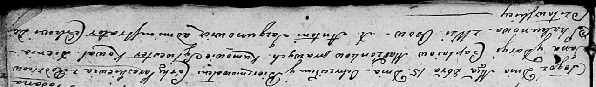

**Чапляй Параскевия Янова (Czaplaiowna Paraskiewija)**

15 октября 1805 г -- крещение (НИАБ 136-13-894, лист 58, №46/1805-р
(ориг)).

**НИАБ 136-13-894:** Лист 58. **Метрическая запись №46/1805-р (ориг).**

Дедиловичская Покровская церковь. 15 октября 1805 года. Метрическая
запись о крещении.

Czaplaiowna Paraskiewija -- дочь родителей с деревни Осовo.

Czaplay Jan -- отец.

Czaplaiowa Daryja -- мать.

Kowal Sylwester -- кум.

Skakunowa Xienia -- кума.

Jazgunowicz Antoni -- ксёндз.
