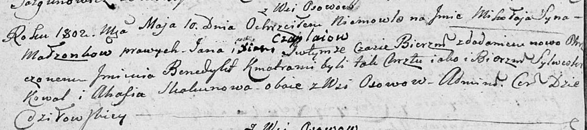

**Чапляй Миколай Янов (Czaplay Mikołay Benedykt)**

10 мая 1803 г -- крещение (НИАБ 136-13-894, лист 50об, №21/1803-р
(ориг)).

**НИАБ 136-13-894:** Лист 50об. **Метрическая запись №21/1803-р
(ориг).**

Дедиловичская Покровская церковь. 10 мая 1803 года. Метрическая запись о
крещении.

Czaplay Mikołay Benedykt -- сын родителей с деревни Осовo.

Czaplaj Jan -- отец.

Czaplaiowa Xienia -- мать.

Kowal Sylwester -- кум, с деревни Осовo.

Skakunowa Ahafia -- кума, с деревни Осовo.

Jazgunowicz Antoni -- ксёндз.
