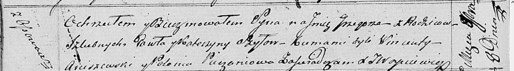

**Шило Павел (Szyło Paweł)**

8 ноября 1817 г -- крещение сына Грыгора (НИАБ 136-13-894, лист 97об,
№64/1817-р (ориг)).

**НИАБ 136-13-894:** Лист 97об. **Метрическая запись №64/1817-р
(ориг).**

Осовская Покровская церковь. 8 ноября 1817 года. Метрическая запись о
крещении.

Szyło Grzegorz -- сын родителей с деревни Осовo.

Szyło Paweł -- отец.

Szyłowa Katerzyna -- мать.

Arciszewski Wincenty -- кум.

Piezsaniowa Połonia -- кума.

Woyniewicz Tomasz -- ксёндз.
