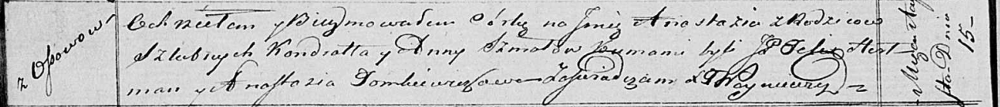

**Шмат Анастасия Кондратова (Szmatowna Anastazija)**

15 августа 1820 г -- крещение (НИАБ 136-13-894, лист 104об, №27/1820-р
(ориг)).

**НИАБ 136-13-894:** Лист 104об. **Метрическая запись №27/1820-р
(ориг).**

Осовская Покровская церковь. 15 августа 1820 года. Метрическая запись о
крещении.

Szmatowna Anastazija -- дочь родителей с деревни Осовo.

Szmat Kondrat -- отец.

Szmatowa Anna -- мать.

Arciszewski Felix, JP -- кум, шляхтич.

Tomkiewiczowa Anastazija -- кума.

Woyniewicz Tomasz -- ксёндз.
