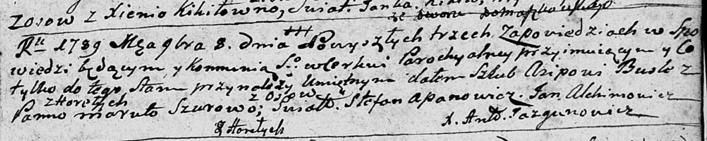

**Бусел (Шур) Марута (Busłowa Maruta z Szurow)**

8 ноября 1789 г -- венчание с Асипом Буслом (НИАБ 136-13-894, лист 68,
№10/1789-б (ориг)).

**НИАБ 136-13-894:** Лист 68. **Метрическая запись №10/1789-б (ориг).**

{width="6.496527777777778in"
height="1.3054746281714786in"}

Дедиловичская Покровская церковь. 8 ноября 1789 года. Метрическая запись
о венчании.

Busla Asip -- жених, с деревни Горелое.

Szurowa Maruta -- невеста, с деревни Осово.

Apanowicz Stefan -- свидетель.

Alchimowicz Jan -- свидетель.

Jazgunowicz Antoni -- ксёндз.
