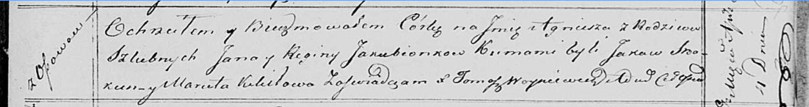

**Якубёнок Агнеша Янова (Jakubionkowna Agniesza)**

1 апреля 1820 г -- крещение (НИАБ 136-13-894, лист 104, №9/1820-р
(ориг)).

**НИАБ 136-13-894:** Лист 104. **Метрическая запись №9/1820-р (ориг).**

Осовская Покровская церковь. 1 апреля 1820 года. Метрическая запись о
крещении.

Jakubionkowna Agniesza -- дочь родителей с деревни Осовo.

Jakubionak Jan -- отец.

Jakubionkowa Regina -- мать.

Skakun Jakow -- кум.

Kikiłowa Maruta -- кума.

Woyniewicz Tomasz -- ксёндз.
