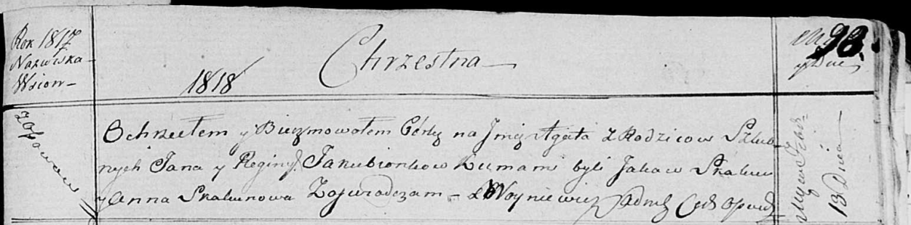

**Якубёнок Елена Янова (Jakubionkowna Helena)**

29 мая 1816 г -- крещение (НИАБ 136-13-894, лист 93об, №13/1816-р
(ориг)).

**НИАБ 136-13-894:** Лист 93об. **Метрическая запись №13/1816-р
(ориг).**

{width="6.496527777777778in"
height="0.9320024059492563in"}

Осовская Покровская церковь. 29 мая 1816 года. Метрическая запись о
крещении.

Jakubionkowna Helena -- дочь родителей с деревни Осовo.

Jakubionek Jan -- отец.

Jakubionkowa Regina -- мать.

Skakun Jakow -- кум.

Skakunowa Anna -- кума.

Woyniewicz Tomasz -- ксёндз.
