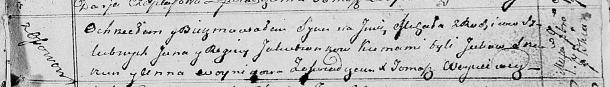

**Якубёнок Михал Янов (Jakubionek Michał)**

7 сентября 1813 г -- крещение (НИАБ 136-13-894, лист 87, №28/1813-р
(ориг)).

**НИАБ 136-13-894:** Лист 87. **Метрическая запись №28/1813-р (ориг).**

Осовская Покровская церковь. 7 сентября 1813 года. Метрическая запись о
крещении.

Jakubionek Michał -- сын родителей с деревни Осовo.

Jakubionek Jan -- отец.

Jakubionkowa Regina -- мать.

Skakun Jakow -- кум.

Woyniczowa Anna -- кума.

Woyniewicz Tomasz -- ксёндз.
