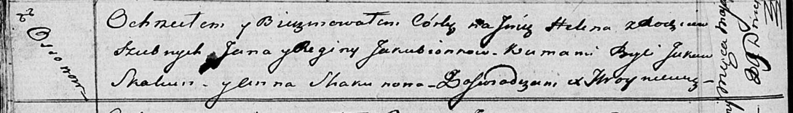

**Якубёнок Ян (Jakubionek Jan)**

16 февраля 1813 г -- венчание с девкой Региной Коренько с деревни Осово
(НИАБ 136-13-920, лист 19, №3/1813-б (ориг)).

7 сентября 1813 г -- крещение сына Михала (НИАБ 136-13-894, лист 87,
№28/1813-р (ориг)).

29 мая 1816 г -- крещение дочери Елены (НИАБ 136-13-894, лист 93об,
№13/1816-р (ориг)).

13 февраля 1818 г -- крещение дочери Агаты (НИАБ 136-13-894, лист 98,
№3/1818-р (ориг)).

1 апреля 1820 г -- крещение дочери Агнеши (НИАБ 136-13-894, лист 104,
№9/1820-р (ориг)).

**НИАБ 136-13-920:** Лист 19. **Метрическая запись №3/1813-б (ориг).**

{width="6.496527777777778in"
height="1.3805708661417322in"}

Осовская Покровская церковь. 16 февраля 1813 года. Запись о венчании.

Jakubionek Jan -- жених, молодой, парафии Осовской, плебания Осовская, с
деревни Осово.

Korzeńkowna Regina -- невеста, девка, парафии Осовской, с деревни Осово.

Pieczań Kondrat -- свидетель.

Korzenka Onufry -- свидетель.

Woyniewicz Tomasz -- ксёндз.

**НИАБ 136-13-894:** Лист 87. **Метрическая запись №28/1813-р (ориг).**

{width="6.496527777777778in"
height="0.9387073490813649in"}

Осовская Покровская церковь. 7 сентября 1813 года. Метрическая запись о
крещении.

Jakubionek Michał -- сын родителей с деревни Осовo.

Jakubionek Jan -- отец.

Jakubionkowa Regina -- мать.

Skakun Jakow -- кум.

Woyniczowa Anna -- кума.

Woyniewicz Tomasz -- ксёндз.

**НИАБ 136-13-894:** Лист 93об. **Метрическая запись №13/1816-р
(ориг).**

{width="6.496527777777778in"
height="0.9320024059492563in"}

Осовская Покровская церковь. 29 мая 1816 года. Метрическая запись о
крещении.

Jakubionkowna Helena -- дочь родителей с деревни Осовo.

Jakubionek Jan -- отец.

Jakubionkowa Regina -- мать.

Skakun Jakow -- кум.

Skakunowa Anna -- кума.

Woyniewicz Tomasz -- ксёндз.

**НИАБ 136-13-894:** Лист 98. **Метрическая запись №3/1818-р (ориг).**

{width="6.496527777777778in"
height="1.6085422134733158in"}

Осовская Покровская церковь. 13 февраля 1818 года. Метрическая запись о
крещении.

Jakubionkowna Agata -- дочь родителей с деревни Осовo.

Jakubionek Jan -- отец.

Jakubionkowa Regina -- мать.

Skakun Jakaw -- кум.

Skakunowa Anna -- кума.

Woyniewicz Tomasz -- ксёндз.

**НИАБ 136-13-894:** Лист 104. **Метрическая запись №9/1820-р (ориг).**

{width="6.496527777777778in"
height="0.8669641294838145in"}

Осовская Покровская церковь. 1 апреля 1820 года. Метрическая запись о
крещении.

Jakubionkowna Agniesza -- дочь родителей с деревни Осовo.

Jakubionak Jan -- отец.

Jakubionkowa Regina -- мать.

Skakun Jakow -- кум.

Kikiłowa Maruta -- кума.

Woyniewicz Tomasz -- ксёндз.
