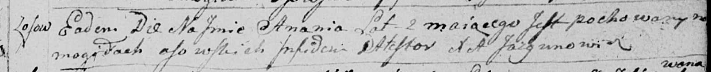

**Ананий (Ananij)**

30 ноября 1794 г -- отпевание, умер в возрасте 2 года (родился около
1792 г) (НИАБ 136-13-919, лист 3, №41/1794-у (ориг)).

**НИАБ 136-13-919:** Лист 3. **Метрическая запись №41/1794-у (ориг).**

Дедиловичская Покровская церковь. 30 ноября 1794 года. Метрическая
запись об отпевании.

Ananij -- умерший, 2 года, с деревни Осово, похоронен на кладбище
деревни Осово.

Jazgunowicz Antoni -- ксёндз.
