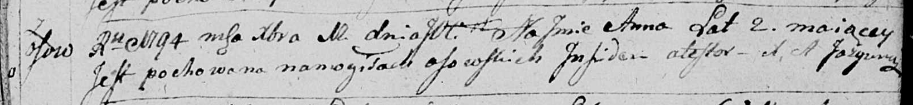

**Анна (Anna)**

12 декабря 1794 г -- отпевание, умерла в возрасте 2 года (родилась около
1792 г) (НИАБ 136-13-919, лист 3, №40/1794-у (ориг)).

**НИАБ 136-13-919:** Лист 3. **Метрическая запись №44/1794-у (ориг).**

Дедиловичская Покровская церковь. 12 декабря 1794 года. Метрическая
запись об отпевании.

Anna -- умершая, 2 года, с деревни Осово, похоронена на кладбище деревни
Осово.

Jazgunowicz Antoni -- ксёндз.
