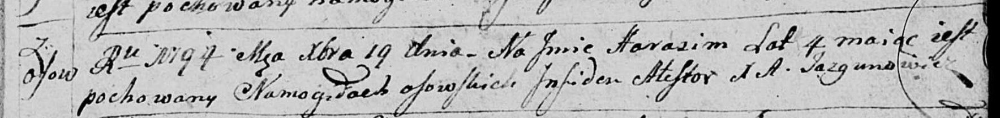

**Гарасим (Harasim)**

19 декабря 1794 г -- отпевание, умер в возрасте 4 года (родился около
1790 г) (НИАБ 136-13-919, лист 3, №49/1794-у (ориг)).

**НИАБ 136-13-919:** Лист 3. **Метрическая запись №49/1794-у (ориг).**

Дедиловичская Покровская церковь. 19 декабря 1794 года. Метрическая
запись об отпевании.

Harasim -- умерший, 4 года, с деревни Осово, похоронен на кладбище
деревни Осово.

Jazgunowicz Antoni -- ксёндз.
