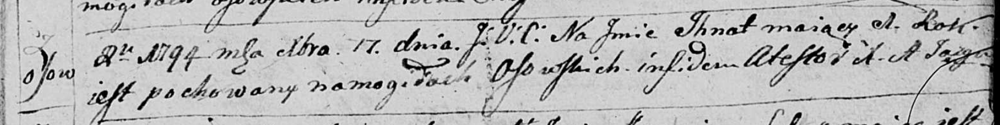

**Игнат (Jhnat)**

17 декабря 1794 г -- отпевание, умер в возрасте 1 год (родился около
1793 г) (НИАБ 136-13-919, лист 3, №48/1794-у (ориг)).

**НИАБ 136-13-919:** Лист 3. **Метрическая запись №48/1794-у (ориг).**

Дедиловичская Покровская церковь. 17 декабря 1794 года. Метрическая
запись об отпевании.

Jhnat -- умерший, 1 год, с деревни Осово, похоронен на кладбище деревни
Осово.

Jazgunowicz Antoni -- ксёндз.
