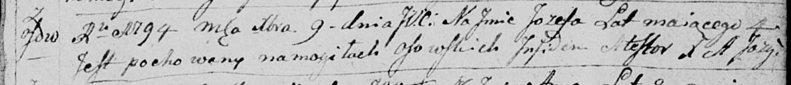

**Иосиф (Jozef)**

9 декабря 1794 г -- отпевание, умер в возрасте 4 года (родился около
1790 г) (НИАБ 136-13-919, лист 3, №43/1794-у (ориг)).

**НИАБ 136-13-919:** Лист 3. **Метрическая запись №43/1794-у (ориг).**

{width="6.496527777777778in"
height="0.7020833333333333in"}

Дедиловичская Покровская церковь. 9 декабря 1794 года. Метрическая
запись об отпевании.

Jozef -- умерший, 4 года, с деревни Осово, похоронен на кладбище деревни
Осово.

Jazgunowicz Antoni -- ксёндз.
