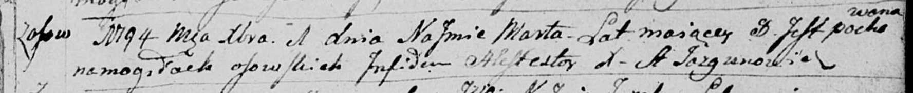

**Марта (Marta)**

1 декабря 1794 г -- отпевание, умерла в возрасте 8 лет (родилась около
1786 г) (НИАБ 136-13-919, лист 3, №42/1794-у (ориг)).

**НИАБ 136-13-919:** Лист 3. **Метрическая запись №42/1794-у (ориг).**

Дедиловичская Покровская церковь. 1 декабря 1794 года. Метрическая
запись об отпевании.

Marta -- умершая, 8 лет, с деревни Осово, похоронен на кладбище деревни
Осово.

Jazgunowicz Antoni -- ксёндз.
