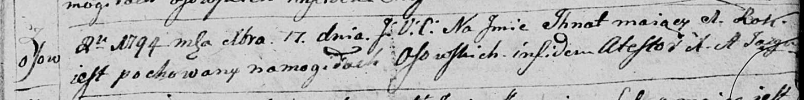

**Тодор (Teodor)**

19 декабря 1794 г -- отпевание, умер в возрасте 5 лет (родился около
1789 г) (НИАБ 136-13-919, лист 3, №50/1794-у (ориг)).

**НИАБ 136-13-919:** Лист 3. **Метрическая запись №50/1794-у (ориг).**

{width="6.496527777777778in"
height="0.7229166666666667in"}

Дедиловичская Покровская церковь. 19 декабря 1794 года. Метрическая
запись об отпевании.

Teodor -- умерший, 5 лет, с деревни Осово, похоронен на кладбище деревни
Осово.

Jazgunowicz Antoni -- ксёндз.
