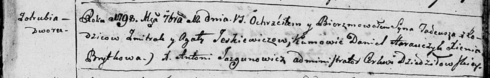

**Еськевич Агата (Jeskewiczowa Agata)**

12 сентября 1798 г -- крещение сына Тадея (НИАБ 136-13-894, лист 37,
№43/1798-р (ориг)).

**НИАБ 136-13-894:** Лист 37. **Метрическая запись №43/1798-р (ориг).**

Дедиловичская Покровская церковь. 12 сентября 1798 года. Метрическая
запись о крещении.

Jeskiewicz Tadeusz -- сын родителей со двора Отруб.

Jeskiewicz Zmitrok -- отец.

Jeskiewicz Agata -- мать.

Harauczyk Daniel - кум.

Brytkowa Xienia - кума.

Jazgunowicz Antoni -- ксёндз.
