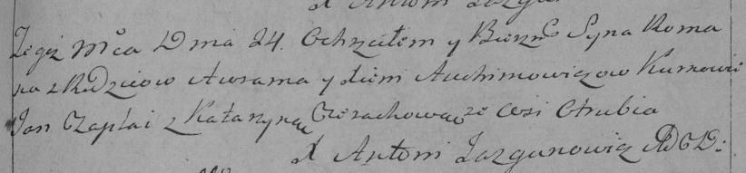

**Авхимович Грыпина Аврамова (Auchimowiczowna Hrypina)**

14 июля 1790 г -- крещение (НИАБ 136-13-894, лист 10, №41/1790-р
(ориг)).

**НИАБ 136-13-894:** Лист 10. **Метрическая запись №41/1790-р (ориг).**

{width="6.496527777777778in"
height="0.8595877077865267in"}

Дедиловичская Покровская церковь. 14 июля 1790 года. Метрическая запись
о крещении.

Auchimowiczowna Hrypina -- дочь родителей с деревни Отруб.

Auchimowicz Awram -- отец.

Auchimowiczowa Xienia -- мать.

Czaplay Jan - кум.

Cierachowa Katerzyna - кума.

Jazgunowicz Antoni -- ксёндз.
