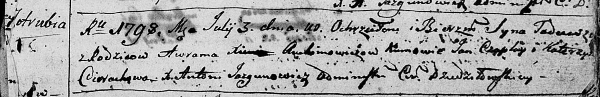

**Авхимович Ксеня (Auchimowiczowa Xienia)**

14 июля 1790 г -- крещение дочери Грыпины (НИАБ 136-13-894, лист 10,
№41/1790-р (ориг)).

24 июля 1794 г -- крещение сына Романа (НИАБ 136-13-894, лист 22,
№29/1794-р (ориг)), (РГИА 823-2-18, лист 250, №19/1794-р (коп)).

3 июля 1798 г -- крещение сына Тадей (НИАБ 136-13-894, лист 36,
№30/1798-р (ориг)), (РГИА 823-2-18, лист 264об, №30/1798-р (коп)).

**НИАБ 136-13-894:** Лист 10. **Метрическая запись №41/1790-р (ориг).**

Дедиловичская Покровская церковь. 14 июля 1790 года. Метрическая запись
о крещении.

Auchimowiczowna Hrypina -- дочь родителей с деревни Отруб.

Auchimowicz Awram -- отец.

Auchimowiczowa Xienia -- мать.

Czaplay Jan - кум.

Cierachowa Katerzyna - кума.

Jazgunowicz Antoni -- ксёндз.

**НИАБ 136-13-894:** Лист 22. **Метрическая запись №29/1794-р (ориг).**

Дедиловичская Покровская церковь. 24 июля 1794 года. Метрическая запись
о крещении.

Auchimowicz Roman -- сын родителей с деревни Отруб.

Auchimowicz Awram -- отец.

Auchimowiczowa Xienia -- мать.

Czaplay Jan - кум.

Cierachowa Katerzyna - кума.

Jazgunowicz Antoni -- ксёндз.

**РГИА 823-2-18:** Лист 250. **Метрическая запись №19/1794-р (коп).**

Дедиловичская Покровская церковь. 24 июля 1794 года. Метрическая запись
о крещении.

Auchimowicz Roman -- сын родителей с деревни Отруб.

Auchimowicz Awram -- отец.

Auchimowiczowa Xienia -- мать.

Czaplay Jan -- кум.

Cierachowa Katarzyna -- кума.

Jazgunowicz Antoni -- ксёндз.

**НИАБ 136-13-894:** Лист 36. **Метрическая запись №30/1798-р (ориг).**

Дедиловичская Покровская церковь. 3 июля 1798 года. Метрическая запись о
крещении.

Auchimowicz Tadeusz -- сын родителей с деревни Отруб.

Auchimowicz Awram -- отец.

Auchimowiczowa Xienia -- мать.

Czaplay Jan - кум.

Cierachowa Katerzyna - кума.

Jazgunowicz Antoni -- ксёндз.

**РГИА 823-2-18:** Лист 264об. **Метрическая запись №30/1798-р (коп).**

Дедиловичская Покровская церковь. 3 июля 1798 года. Метрическая запись о
крещении.

Auchimowicz Thadeusz -- сын родителей с деревни Отруб.

Auchimowicz Awraam -- отец.

Auchimowiczowa Xienia -- мать.

Czaplay Jan -- кум.

Cierachowa Katerzyna -- кума.

Jazgunowicz Antoni -- ксёндз.
