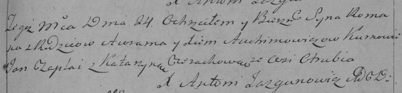

**Авхимович Роман Аврамов (Auchimowicz Roman)**

24 июля 1794 г -- крещение (НИАБ 136-13-894, лист 22, №29/1794-р
(ориг)), (РГИА 823-2-18, лист 250, №19/1794-р (коп)).

**НИАБ 136-13-894:** Лист 22. **Метрическая запись №29/1794-р (ориг).**

{width="6.496527777777778in"
height="1.1257786526684164in"}

Дедиловичская Покровская церковь. 24 июля 1794 года. Метрическая запись
о крещении.

Auchimowicz Roman -- сын родителей с деревни Отруб.

Auchimowicz Awram -- отец.

Auchimowiczowa Xienia -- мать.

Czaplay Jan - кум.

Cierachowa Katerzyna - кума.

Jazgunowicz Antoni -- ксёндз.

**РГИА 823-2-18:** Лист 250. **Метрическая запись №19/1794-р (коп).**

{width="6.496527777777778in"
height="1.5097222222222222in"}

Дедиловичская Покровская церковь. 24 июля 1794 года. Метрическая запись
о крещении.

Auchimowicz Roman -- сын родителей с деревни Отруб.

Auchimowicz Awram -- отец.

Auchimowiczowa Xienia -- мать.

Czaplay Jan -- кум.

Cierachowa Katarzyna -- кума.

Jazgunowicz Antoni -- ксёндз.
