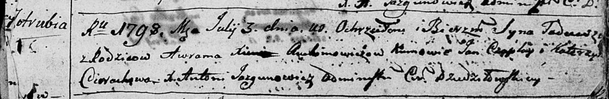
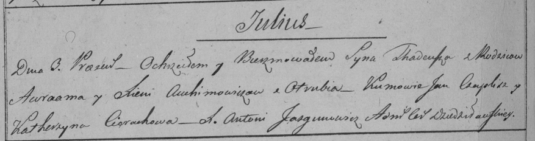

**Авхимович Тадей Аврамов (Auchimowicz Tadeusz)**

3 июля 1798 г -- крещение (НИАБ 136-13-894, лист 36, №30/1798-р (ориг)),
(РГИА 823-2-18, лист 264об, №30/1798-р (коп)).

**НИАБ 136-13-894:** Лист 36. **Метрическая запись №30/1798-р (ориг).**

Дедиловичская Покровская церковь. 3 июля 1798 года. Метрическая запись о
крещении.

Auchimowicz Tadeusz -- сын родителей с деревни Отруб.

Auchimowicz Awram -- отец.

Auchimowiczowa Xienia -- мать.

Czaplay Jan - кум.

Cierachowa Katerzyna - кума.

Jazgunowicz Antoni -- ксёндз.

**РГИА 823-2-18:** Лист 264об. **Метрическая запись №30/1798-р (коп).**

Дедиловичская Покровская церковь. 3 июля 1798 года. Метрическая запись о
крещении.

Auchimowicz Thadeusz -- сын родителей с деревни Отруб.

Auchimowicz Awraam -- отец.

Auchimowiczowa Xienia -- мать.

Czaplay Jan -- кум.

Cierachowa Katerzyna -- кума.

Jazgunowicz Antoni -- ксёндз.
